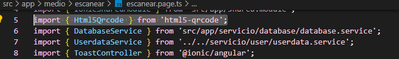
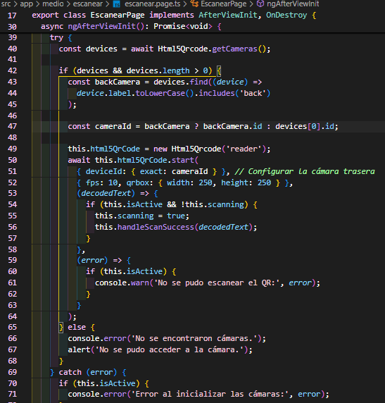

**Archivo README AsistApp**

---
**DESCRIPCIÓN**
 AsistApp es una aplicación que tiene por objetivo facilitar los registros de asistencia dentro de un contexto de pandemia, donde los estudiantes utilizan mascarillas todo su horario escolar y por ende los profesores se ven dificultades al momento de oírlos y distinguirlos. Consiste en una aplicación por la cual los docentes realizan un código QR, los alumnos deben ingresar por medio de sus cuentas personales y escanear el QR por medio de la opción de escaneo y finalmente el sistema registra la asistencia del alumno.

---

**LIBRERIAS**

1.-@ionic/angular: Para desarrollar aplicaciones utilizando Ionic.

2.-@angular/material: Para acceder a componentes de Material Design.

3.-html5-qrcode: es una biblioteca JavaScript ligera que permite leer códigos QR utilizando la cámara de un dispositivo directamente desde el navegador.\
**Instalación:**\
Primero se escribe en la terminal:\
```npm install html5-qrcode```\
Luego se importa en componentes\
```import { Html5Qrcode } from "html5-qrcode";```

**Evidencia de uso:** en escanear.page.ts




-Para instalar las librerías necesarias, usa el siguiente comando en la terminal:\
```npm install```

---

APIs:(Especifica la evidencia del consumo de API y los parámetros de conexión)
Api del clima:

Evidencia de uso:

---

PLUGINS:(Especifica la evidencia de la integración del plugin en el archivo README.md, detallando su instalación y uso.)

1.-@capacitor/push-notifications: Para manejar notificaciones push.\
Se instala en la terminal:\
```npm install @capacitor/push-notifications```\
Evidencia de uso:


2.-

---

TESTING y APK:(Respalda la evidencia de las pruebas y generación del APK en el archivo README.md, incluyendo los pasos realizados y resultados obtenidos.)

---

PUBLICACIÓN de la App:(Incluye en el archivo README.md la evidencia del comando utilizado para la firma, especificando el nombre y ubicación del archivo generado.)
