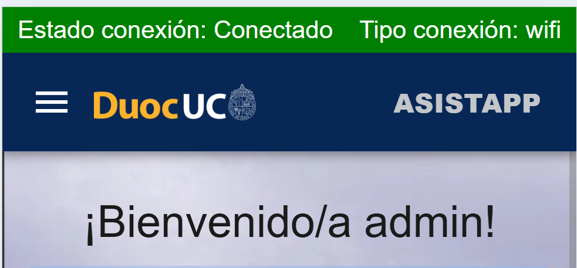

****
<h1 style="text-align: center;">Archivo README AsistApp</h1>

<h3 style="text-align: center;">DESCRIPCIÓN</h3>
 AsistApp es una aplicación que tiene por objetivo facilitar los registros de asistencia dentro de un contexto de pandemia, donde los estudiantes utilizan mascarillas todo su horario escolar, y por ende los profesores se les complica oírlos y distinguirlos. En esta aplicación móvil los docentes realizan un código QR, los alumnos deben ingresar por medio de sus cuentas personales y escanear el QR por medio de la opción de escaneo y finalmente el sistema registra la asistencia del alumno.

---

<h3 style="text-align: center;">LIBRERÍAS</h3>

1.```-@ionic/angular:``` Para desarrollar aplicaciones utilizando Ionic.

2.-```@angular/material:``` Para acceder a componentes de Material Design.

3.-```html5-qrcode:``` es una biblioteca de JavaScript ligera que permite leer códigos QR utilizando la cámara de un dispositivo directamente desde el navegador.\
**Instalación:**\
Primero se escribe en la terminal:
```bash
npm install html5-qrcode
```
Luego se importa en componentes\
```import { Html5Qrcode } from "html5-qrcode";```

**Evidencia de uso:** en escanear.page.ts


-Para instalar las librerías necesarias, usa el siguiente comando en la terminal:
```bash
npm install
```

---

<h3 style="text-align: center;">APIs</h3>
Api del clima:
Open-Meteo es una API meteorológica de código abierto y ofrece acceso gratuito para uso no comercial(open-meteo.com).


**Parámetros:**\
Los parámetros de consulta son:\
```latitude=52.52:``` Especifica la latitud de la ubicación para la cual se desea obtener el clima.\
```longitude=13.41:``` Especifica la longitud de la ubicación.\
```current=temperature_2m,wind_speed_10m:``` Indica que deseas recibir datos actuales de temperatura a 2 metros de altura y velocidad del viento a 10 metros de altura.\
```hourly=temperature_2m,relative_humidity_2m,wind_speed_10m:``` Especifica que deseas recibir datos horarios de temperatura, humedad relativa y velocidad del viento.\
Los parámetros de respuesta:\
Datos Actual (current):\
```time:``` La hora a la que se registraron los datos actuales.\
```temperature_2m:``` La temperatura actual a 2 metros de altura.\
```wind_speed_10m```: La velocidad del viento actual a 10 metros de altura.\
Datos Horarios (hourly):\
```time:``` Una lista de tiempos (fechas y horas) para los cuales se registraron los datos horarias.\
```wind_speed_10m:``` Un array que contiene la velocidad del viento para cada hora correspondiente.\
```temperature_2m:``` Un array que muestra la temperatura registrada a 2 metros de altura para cada hora.\
```relative_humidity_2m:``` Un array que proporciona la humedad relativa a 2 metros de altura para cada hora.

**Evidencia de uso:**
<div style="text-align: center;">


</div>

---
<h3 style="text-align: center;">PLUGINS</h3>


1.-@capacitor/network: Es un network pluging, el cual detecta el estado de la red (en línea o fuera de línea) y el tipo de conexión que tienes al ingresar a la aplicación móvil.\
Se instala en la terminal:
```bash
npm install @capacitor/network
```
Evidencia de uso:
<div style="text-align: center;">



</div>
---
<h3 style="text-align: center;">TESTING</h3>


Durante el proceso de testing utilizamos Jasmine + Karma para realizar diversas pruebas, las cuales se ven a continuación.


---
<h3 style="text-align: center;">PUBLICACION DE LA APP</h3>


Para publicar la aplicación, es necesario generar un archivo APK firmado. A continuación se detallan los pasos para llevar a cabo este proceso:

### 1. Generar la Clave de Firma

Primero, necesitas generar una clave para firmar la aplicación. Usa el siguiente comando en la terminal:

```bash
keytool -genkey -v -keystore my-release-key.jks -keyalg RSA -keysize 2048 -validity 10000 -alias my-assistapp
```
Detalles de la Clave\
Alias: my-assistapp\
Contraseña: colocolo21\
Ubicación de la Clave: Raíz del proyecto.

### 2. Generar el APK
Asegúrate de estar en la carpeta del proyecto y ejecuta los siguientes comandos en la terminal:

```bash
ionic build
ionic cap add android
ionic cap copy
ionic cap open android
```
### 3. Firma

Comando de generación de firma
KEY
 keytool -genkey -v -keystore my-release-key.jks -keyalg RSA -keysize 2048 -validity 10000 -alias my-assistapp


### 4. Publicación

La app puede ser encontrada por medio del siguiente enlace: 

https://gleaming-cascaron-b1f24c.netlify.app/